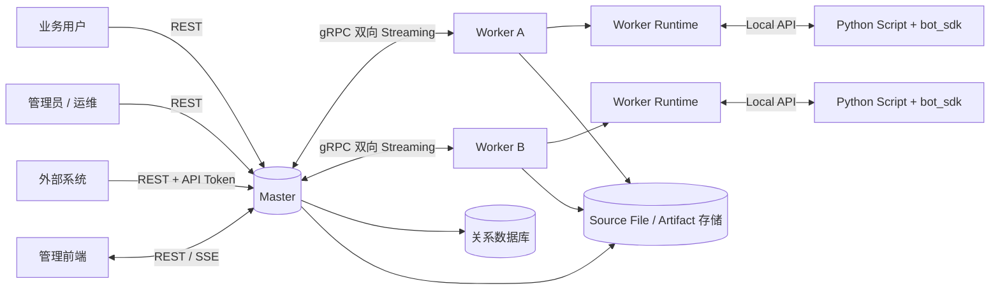
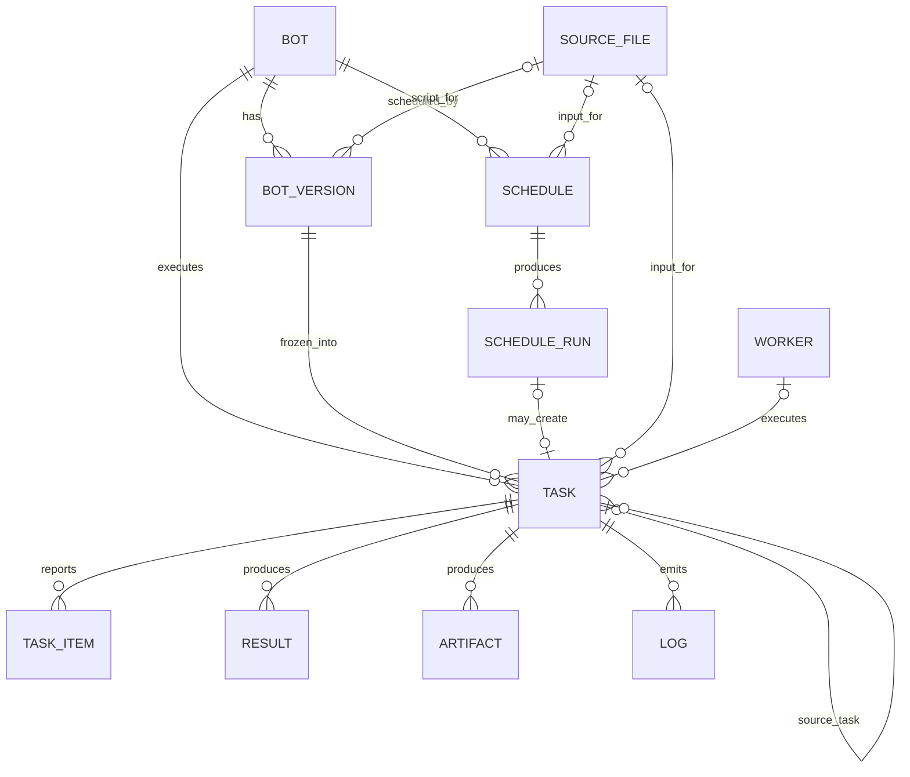
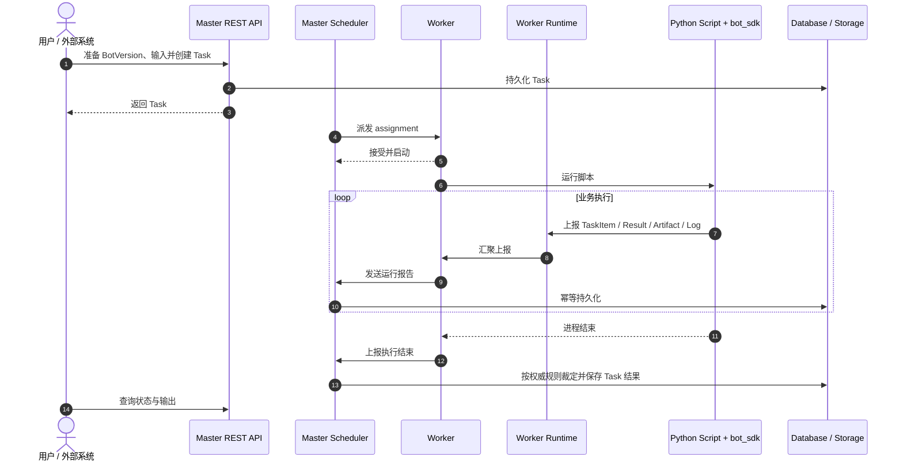
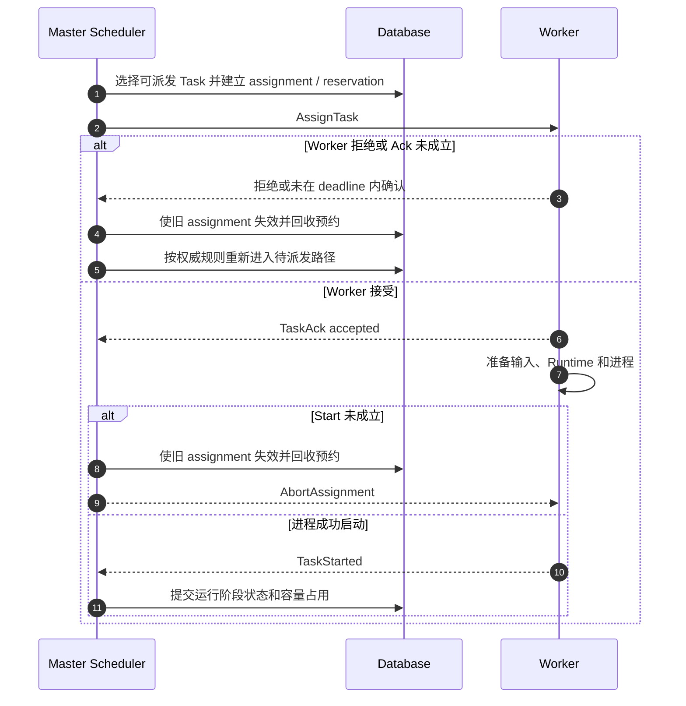
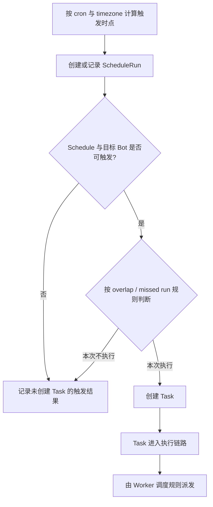
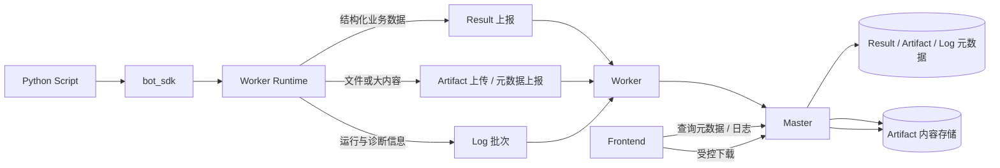
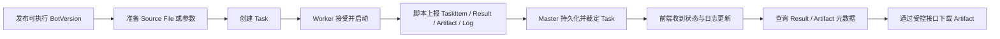

# Bot 自动化任务平台 V1：流程图与讨论辅助材料

> [本文件角色]
> 本文件只提供非规范性的 Mermaid 图和端到端走查，用于建立系统上下文、核对资源关系和组织验收；不定义状态、字段、算法、SQL、错误表或协议 payload。
> 若图示与主题规范存在差异，以 [文档目录.md](文档目录.md#document-guide) 指向的权威章节为准；未闭环问题统一见 [待对齐问题.md](待对齐问题.md#alignment-issues)。

## 快速导航

[权威来源](#authority-map) · [系统上下文](#system-context) · [资源关系](#resource-map) · [执行走查](#execution-walkthrough) · [派发握手](#dispatch-handshake) · [Schedule](#schedule-walkthrough) · [输出](#output-walkthrough) · [验收](#acceptance-walkthrough)

## 阅读方式与权威来源

本文只回答“组件和资源如何串起来”。需要判断具体行为时，直接回到下列权威来源：

| 主题 | 权威文档 |
|---|---|
| 平台定位与组件边界 | [平台概览.md](平台概览.md#architecture-overview) |
| Bot / BotVersion | [Bot规范.md](Bot规范.md#bot-model) |
| Task / TaskItem 状态、统计和 API | [Task执行规范.md](Task执行规范.md#task-status) |
| Worker 协议、派发与 Runtime | [Worker协议与运行时.md](Worker协议与运行时.md#worker-protocol) |
| Schedule / ScheduleRun | [Schedule调度规范.md](Schedule调度规范.md#schedule-api) |
| Source File | [源文件.md](./源文件.md#source-file-api) |
| Result / Artifact / Log | [结果-产物-日志.md](结果-产物-日志.md#result-artifact-log-api) |
| MVP 实施范围 | [MVP范围.md](MVP范围.md#mvp-scope) |
| 跨层未闭环问题 | [待对齐问题.md](待对齐问题.md#alignment-issues) |

走查原则：

1. 图中的节点名称用于定位权威章节，不形成新的字段或状态枚举。
2. 图中省略的失败、幂等、权限和竞态分支，以主题规范为准。
3. 不从图中的箭头顺序推导事务、重试或持久化算法。

## 系统上下文图

走查重点：外部调用只进入 Master；脚本通过本机 Runtime 上报；Master 与 Worker 的控制面边界见 [Worker 协议](Worker协议与运行时.md#worker-protocol)，安全边界见 [安全基线](安全基线.md#security-baseline)。

## 核心资源关系图

走查重点：Task 是一次执行，TaskItem 是执行明细；Source File 是输入资源，Artifact 是运行输出。各关系的可空性、生命周期和引用校验不由本图定义，分别见 [Bot](Bot规范.md#bot-model)、[Task](Task执行规范.md#task-model)、[Source File](./源文件.md#source-file-api)和[输出资源](结果-产物-日志.md#result-artifact-log-api)。

## Task 执行走查

本图只展示主链路。Task 终态裁定、取消、超时和统计冲突见 [Task 状态机](Task执行规范.md#task-status)；Runtime 报告结构见 [Worker Runtime / SDK](Worker协议与运行时.md#runtime-sdk)。

## Task 派发握手走查

走查时重点核对 assignment、会话、deadline 和 fencing，但不在本文复制判定算法或竞态矩阵。完整规则见 [Worker 调度](Worker协议与运行时.md#worker-dispatch)及 [Task Ack / Start 规则](Task执行规范.md#task-status)。

## Schedule 触发走查

本图不展开枚举、jitter 算法或补跑细节。完整触发和 ScheduleRun 语义见 [Schedule 规范](Schedule调度规范.md#schedule-api)，第一版实施裁剪见 [MVP 范围](MVP范围.md#mvp-scope)。

## Result、Artifact 与 Log 输出走查

走查重点：Result、Artifact、Log 的职责不同，Source File 不属于输出资源。Artifact `storage_key` 的对外边界由 [`ALIGN-003`](待对齐问题.md#align-003) 跟踪，Log `seq` / SSE 恢复持久化由 [`ALIGN-004`](待对齐问题.md#align-004) 跟踪；本文不选择任何一侧。当前主题契约见 [结果-产物-日志.md](结果-产物-日志.md#result-artifact-log-api)。

## 端到端验收走查

验收材料应从权威规范生成，而不是从本图补充业务规则。至少覆盖以下走查类别：

- 正常执行和不同 TaskItem 统计组合；
- `pending`、派发中和运行中的取消；
- 整体超时及迟到消息；远程进程终止闭环按 [`ALIGN-006`](待对齐问题.md#align-006) 跟踪；
- Worker 在派发前后离线的不同处理；
- retry / rerun 的新 Task 与历史追溯；
- Schedule 基础触发和重叠裁剪；
- SSE 断线恢复、输出查询与下载权限；
- assignment fencing 和旧消息丢弃。

具体期望结果分别取自 [Task 规范](Task执行规范.md#task-status)、[Worker 规范](Worker协议与运行时.md#worker-dispatch)、[Schedule 规范](Schedule调度规范.md#schedule-api)、[输出资源规范](结果-产物-日志.md#result-artifact-log-api)和[安全基线](安全基线.md#security-baseline)。如验收依赖尚未闭环的跨层语义，应链接 [待对齐问题.md](待对齐问题.md#alignment-issues)，而不是在本文创建本地问题清单。流程图治理约束由 [`ALIGN-007`](待对齐问题.md#align-007) 持续跟踪。
